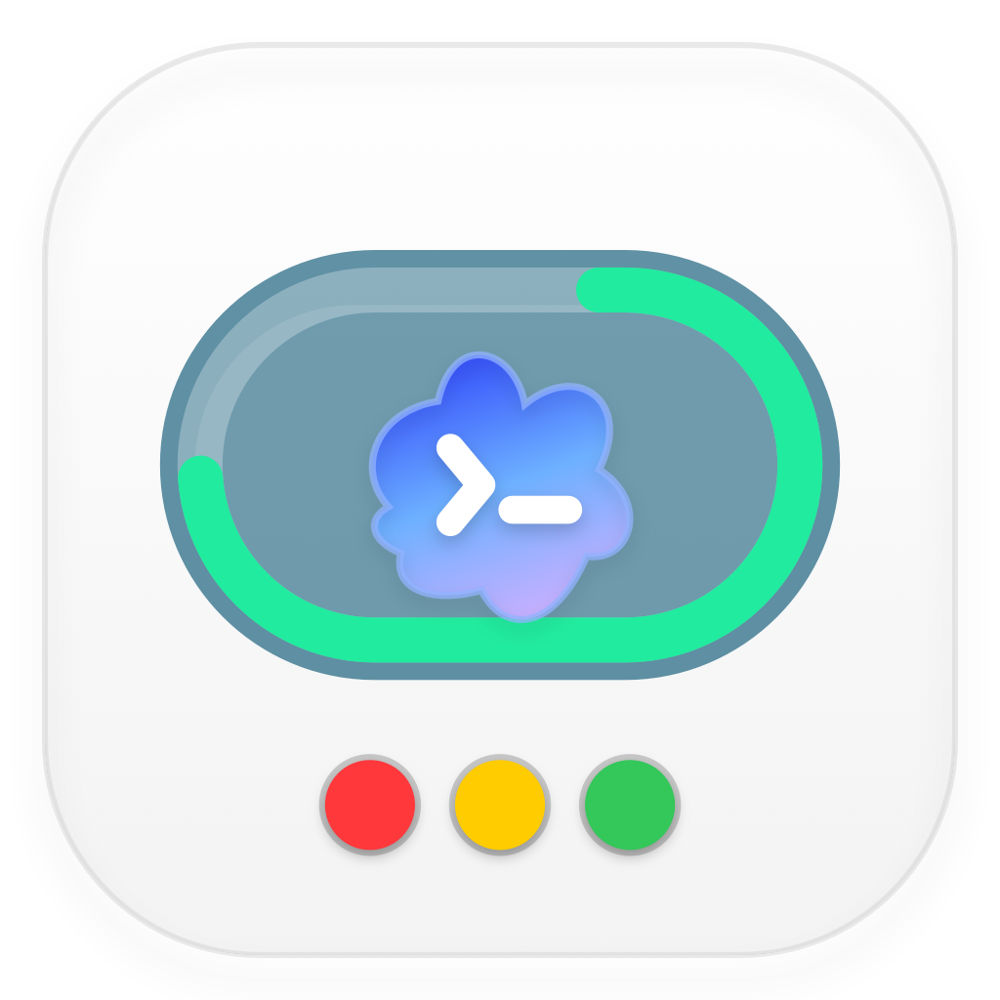

# CodexMonitorMinibar

[中文文档](README.zh-CN.md)

CodexMonitorMinibar is a native macOS menu bar app for monitoring local Codex quota and Codex session activity.

It shows today's local token usage, 5-hour quota, weekly quota, 5-hour reset progress as a capsule border, and a compact activity light driven by Codex hooks.

## Background

This app was built to help use the 20x Pro Codex quota as fully as possible. Because quota and session state need to be visible while working, CodexMonitorMinibar lives in the macOS menu bar instead of a separate window.

## Preview




## Features

- Native AppKit menu bar app (`LSUIElement`)
- Reads Codex quota from the local Codex app-server
- Displays:
  - today's local token usage
  - 5-hour quota remaining and reset countdown
  - weekly quota remaining and reset countdown
  - capsule border progress for 5-hour used quota
- Moves detailed quota progress bars into the menu
- Shows today's local input/cache/output/reasoning token breakdown in the menu
- Tracks Codex activity through hooks
- Supports multiple Codex sessions
- Automatically installs the required Codex hooks on app launch
- Keeps existing Codex hooks and avoids duplicate hook insertion

## Status Colors

| Indicator | Meaning |
| --- | --- |
| 🟢 Green | Codex is working right now, for example a session is running or using tools |
| 🔴 Red | Codex is blocked and needs manual intervention, for example a permission request or a failed tool call |
| 🟡 Yellow | Codex is idle. This is a good time to give Codex more work |
| ⚪️ White | Unknown / no current hook data |

White does not mean "idle". It means the app has no reliable activity signal yet, commonly right after launch, before the next Codex hook event, or after all session state has expired.

## Metrics

The menu bar text is intentionally compact:

```text
TK | 5H | WK
```

- `TK` shows today's local token usage on this Mac.
- `5H` shows the remaining percentage for the rolling 5-hour quota window and the time left until that window resets.
- `WK` shows the remaining percentage for the weekly quota window and the time left until that window resets.
- The capsule border shows 5-hour quota usage progress, because the 5-hour window is usually the most urgent limit during active work.
- `This Mac Tokens` is local-only token usage. It is computed from this machine's Codex session JSONL `token_count` events and can differ from the account-level Codex profile page when Codex is used on other devices. The menu shows only today's input/cache/output/reasoning breakdown.

## How It Works

Quota data comes from the local Codex app-server:

```text
/Applications/Codex.app/Contents/Resources/codex app-server proxy --sock ~/.codex/app-server-control/app-server-control.sock
```

If the control socket is unavailable or stale, the app falls back to:

```text
/Applications/Codex.app/Contents/Resources/codex app-server --listen stdio://
```

The app then sends JSON-RPC requests and reads:

```text
account/rateLimits/read
```

The important response fields are:

```text
usedPercent
windowDurationMins
resetsAt
```

Activity data comes from Codex hooks:

```text
Codex hook event
  -> CodexMonitorHookBridge
    -> /tmp/codex-monitor-<uid>.sock
      -> CodexMonitorMinibar
```

The bridge reads one hook JSON payload from stdin, normalizes it, and sends it to the app over a Unix socket. The app keeps an in-memory session map keyed by `session_id`.

Local token usage comes from:

```text
~/.codex/sessions/**/*.jsonl
~/.codex/archived_sessions/**/*.jsonl
```

The app indexes only `token_count` events from JSONL files modified today. It prefers `total_token_usage` deltas when available, falls back to `last_token_usage`, and subtracts inherited parent totals for forked sessions when the parent session is available. The first scan builds an index in:

```text
~/.codex-monitor-minibar/token-usage-index.json
```

After that, refreshes enumerate file metadata and read only changed file tails from the last processed offset. Unchanged JSONL files are not re-read, and older files are skipped.

## Automatic Hook Installation

On launch, the app automatically installs its bridge hook into:

```text
~/.codex/hooks.json
```

It also ensures hooks are enabled in:

```text
~/.codex/config.toml
```

The installed command points to the bridge inside the app bundle:

```text
CodexMonitorMinibar.app/Contents/MacOS/CodexMonitorHookBridge
```

Installed hook events:

```text
SessionStart
UserPromptSubmit
PreToolUse
PermissionRequest
PostToolUse
SubagentStart
SubagentStop
Stop
```

The installer is idempotent. Restarting the app will not insert duplicate hooks for the same app path. Existing hooks are preserved.

## Build

Requirements:

- macOS 13+
- Swift 6 toolchain
- Codex installed at `/Applications/Codex.app`

Build and package the app:

```sh
Scripts/package_app.sh
```

The packaged app is written to:

```text
CodexMonitorMinibar.app
```

Run it with:

```sh
open CodexMonitorMinibar.app
```

## Verification

Run the custom test runner:

```sh
swift run --disable-sandbox CodexMonitorCoreTestRunner
```

Build the products:

```sh
swift build --disable-sandbox --product CodexMonitorMinibar
swift build --disable-sandbox --product CodexMonitorHookBridge
```

Verify the packaged app:

```sh
Scripts/package_app.sh
plutil -lint CodexMonitorMinibar.app/Contents/Info.plist
codesign --verify --deep --strict CodexMonitorMinibar.app
```

## Notes

- Codex local app-server and hook payloads are local Codex implementation details and may change across Codex releases.
- Activity state is kept in memory and expires after 30 minutes.
- The app does not upload quota or hook data.
- macOS may show a Privacy & Security prompt saying that CodexMonitorMinibar was blocked from modifying apps when you click `Open Codex`. That menu item asks Launch Services to open or activate `/Applications/Codex.app`; CodexMonitorMinibar does not patch, replace, or update Codex.app. Allowing the prompt only lets this shortcut launch or switch to Codex. If you deny it, quota and hook monitoring still work, but the `Open Codex` shortcut may not.
- Moving the app to another path changes the bridge command path, so the hook installer may add a new bridge entry for the new path.
